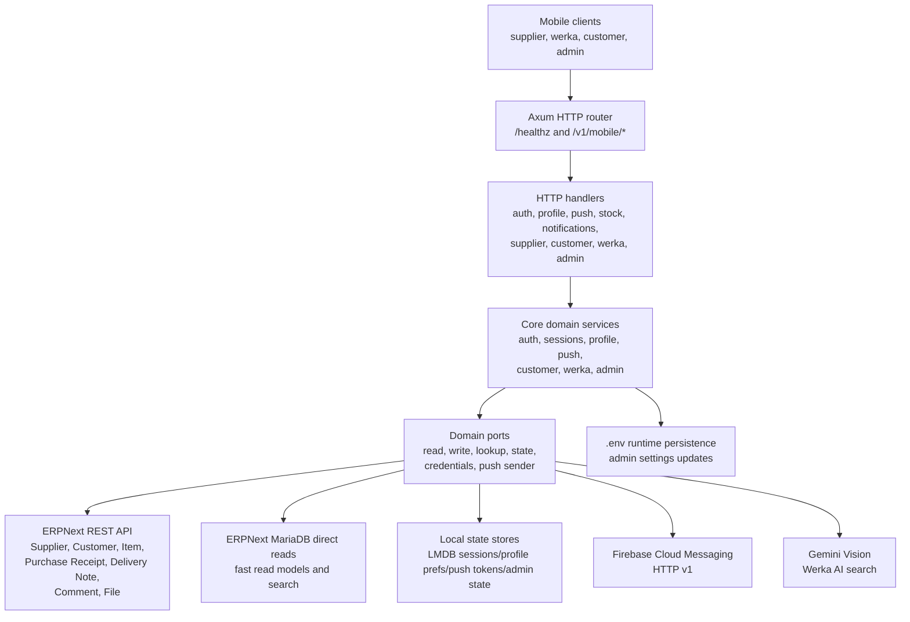
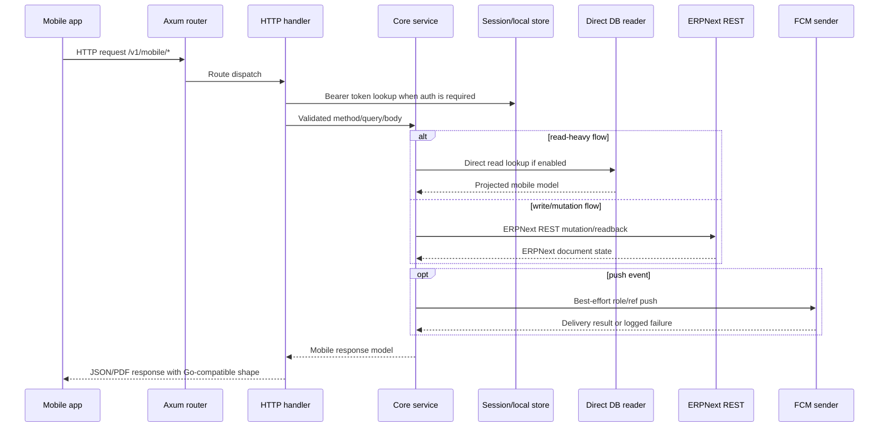

# Accord Mobile Server RS

## What this is

`accord_mobile_server_rs` is a standalone Rust mobile backend for Accord
ERPNext workflows. It serves the existing mobile app directly and preserves the
Go mobile API contract: routes, auth order, status codes, JSON shapes, ERPNext
side effects, push behavior, and runtime settings.

This is the primary Accord mobile backend. The mobile app is expected to talk
to this service directly in production.

## Why it matters

The service can replace the previous mobile backend without a client-side app
change. Read-heavy flows use direct ERPNext MariaDB projections when enabled,
while mutations keep ERPNext REST as the source of truth, giving the mobile app
the same behavior with lower latency on operational screens.

## Quick Start

```bash
cp .env.example .env
cargo fmt --check
cargo test --locked
cargo run --release
```

Configure real `.env` values before production use. At minimum set `ERP_URL`,
`ERP_API_KEY`, `ERP_API_SECRET`, and the store paths. Enable
`ERP_DIRECT_READ_ENABLED=1` only when ERPNext database access is configured.

## Current Production Additions

The 2026-05-20 production branch adds two major runtime capabilities on top of
the stable Rust mobile backend.

### SQLite catalog read cache

Catalog-style reads can now be served from a local SQLite cache synchronized
from ERPNext MariaDB. ERPNext/MariaDB remains the source of truth, and ERPNext
REST remains the write/submit path for mutations.

Cached read scopes:

- items and item groups;
- suppliers and customers;
- supplier item mappings;
- customer item mappings;
- profile phone/avatar lookup for supplier and customer roles.

Covered mobile/admin read paths include:

- admin item pages, item group picker/tree, supplier/customer directories, and
  assigned item lists;
- Werka supplier/customer directories and supplier/customer item pickers;
- GScale catalog item lookup.

Operational documents are intentionally not cached in this phase. Purchase
receipts, delivery notes, stock entries, history, status, archive, and barcode
lookup continue to use the existing direct DB/ERPNext paths.

The cache supports full sync, delta sync for changed rows, delete reconciliation,
and a same-count edge case where one row is deleted while another is inserted
inside the same sync interval. Real ERP tests cover add, update, delete, and
direct DB vs SQLite comparison across all cached read scopes.

Enable with:

```env
ERP_CATALOG_CACHE_ENABLED=1
ERP_CATALOG_CACHE_FALLBACK_DIRECT_DB=1
ERP_CATALOG_CACHE_PATH=data/catalog_cache.sqlite
ERP_CATALOG_CACHE_SYNC_INTERVAL_SECONDS=1
```

Production rollout should keep `ERP_CATALOG_CACHE_FALLBACK_DIRECT_DB=1` enabled
until the cache has been observed under real traffic.

### Role capability packages

Admin-controlled role packages are now separated from the built-in mobile roles.
The base roles still exist and remain the compatibility boundary:

- `admin`
- `werka`
- `supplier`
- `customer`

Custom role packages are stored as named capability sets and can be assigned to
specific principals by base role and reference. This lets the server restrict or
combine existing features without adding a new hard-coded Rust role for every
operator variant.

Runtime endpoints:

- `GET /v1/mobile/admin/capabilities`
- `GET /v1/mobile/admin/roles`
- `PUT /v1/mobile/admin/roles`
- `GET /v1/mobile/admin/role-assignments`
- `PUT /v1/mobile/admin/role-assignments`

Role assignments override the default capability set for the assigned
principal. If an assignment references a missing role package, access fails
closed instead of falling back to the broader default role. The role store also
keeps backward-compatible reading for the first JSON role-map format.

Configure the persistent role store path with:

```env
MOBILE_API_ROLE_STORE_PATH=data/mobile_roles.json
```

## Performance Validation

The current production candidate was validated on 2026-05-15 after the LMDB
local-state migration, SQL pushdown work, HTTP/healthz tuning, Hyper HTTP/1
accept-loop tuning, and FD-pressure fix.

Key results from the final Go vs Rust production benchmark:

| Case | Rust | Go | Result |
| --- | ---: | ---: | --- |
| `admin_login_5k_100` | `5313.61 RPS`, p95 `28ms` | `36.52 RPS`, p95 `5106ms` | Rust much faster |
| `push_fixed_5k_100` | `5847.71 RPS`, p95 `21ms` | `500.24 RPS`, p95 `44ms` | Rust much faster |
| `read_summary_3k_100` | `2488.98 RPS`, p95 `55ms` | `2712.03 RPS`, p95 `73ms` | Go slightly higher RPS, Rust lower p95 |
| `read_home_3k_100` | `735.85 RPS`, p95 `194ms` | `662.19 RPS`, p95 `340ms` | Rust faster |
| `crash_health_60k_1000` | `5819.38 RPS`, `0` failed | `5515.64 RPS`, `0` failed | Rust stable |
| `crash_push_20k_500` | `5152.66 RPS`, `0` failed | `3726.97 RPS`, `0` failed | Rust stable |

The production service stayed healthy after the run with `{"ok":true}`,
`NRestarts=0`, and `LimitNOFILE=65535`. Rust is ready as the primary Accord
mobile backend for this workload.

Important benchmark notes:

- LMDB is now the production default for session, profile, push token, and
  admin local state.
- Session tokens are stored as `SHA-256(token)` keys, with versioned binary
  values and an LMDB expiry index.
- JSON local stores are legacy migration/rollback inputs, not the default
  production path.
- Rust session-heavy workloads are about `88x-90x` faster than the legacy Go
  JSON session store in the measured login benchmarks.
- SQL pushdown is used where it preserves the exact mobile result shape and
  reduces Rust-side row aggregation.
- Mutation endpoints still write through ERPNext REST; direct DB access remains
  read-only.

Full benchmark notes:

- [docs/benchmarks/2026-05-15-final-go-vs-rust-production-battle.md](docs/benchmarks/2026-05-15-final-go-vs-rust-production-battle.md)
- [docs/benchmarks/2026-05-15-go-vs-rust-lmdb-default-battle.md](docs/benchmarks/2026-05-15-go-vs-rust-lmdb-default-battle.md)
- [docs/benchmarks/2026-05-15-go-vs-rust-lmdb-v2-stress.md](docs/benchmarks/2026-05-15-go-vs-rust-lmdb-v2-stress.md)
- [docs/benchmarks/2026-05-15-session-store-lmdb.md](docs/benchmarks/2026-05-15-session-store-lmdb.md)
- [docs/benchmarks/2026-05-15-sql-pushdown.md](docs/benchmarks/2026-05-15-sql-pushdown.md)
- [docs/benchmarks/2026-05-15-healthz-tuning.md](docs/benchmarks/2026-05-15-healthz-tuning.md)
- [docs/benchmarks/2026-05-15-hyper-http1-tuning.md](docs/benchmarks/2026-05-15-hyper-http1-tuning.md)

For the current handoff state, restored ERPNext setup, hard constraints, and
next work, see [AI_HANDOFF_PERFORMANCE.md](AI_HANDOFF_PERFORMANCE.md).

`accord_mobile_server_rs` is an independent Rust service for the Accord mobile
backend. It is a standalone Axum/Tokio application that speaks directly to the
mobile clients, ERPNext, the ERPNext MariaDB database when direct reads are
enabled, Firebase Cloud Messaging, Gemini Vision, and LMDB-backed local state
stores.

This repository is not a wrapper around the Go service, does not shell out to
the Go binary, and does not require the Go project at runtime. The compatibility
target is the mobile HTTP contract and the ERPNext side effects expected by the
existing Accord mobile application. In other words, the mobile app should be
able to talk to this Rust service without observing an API or behavior change.

## Purpose

The service exists to provide the mobile API for the operational flow around:

- supplier authentication, item visibility, dispatch creation, and supplier
  response flows;
- Werka dashboard, pending work, archive, PDF export, item/customer/supplier
  search, confirmation, unannounced receipt, customer delivery issue, and AI
  image search flows;
- customer dashboard, delivery note detail, and delivery response flows;
- profile, avatar upload, avatar proxy, session, and mobile identity flows;
- admin settings, supplier/customer/item management, item group tree
  management, code regeneration, and operational activity flows;
- notification comments/details and role-targeted push notifications.

The implementation is organized as a layered service rather than a monolithic
handler file. HTTP handlers are thin adapters; domain services contain business
rules; ERPNext REST, direct MariaDB reads, local state stores, push, and AI are plugged
in through explicit ports.

## System Architecture



## Request Flow



## Design Principles

### Standalone service boundary

The service owns its runtime process, HTTP router, domain state, ERPNext
clients, database readers, and push sender. The Go implementation is not loaded,
embedded, proxied, or required. During migration, Go-compatible behavior is used
as a contract reference so the mobile client can switch services without a
protocol change.

### Contract compatibility

The API is intentionally conservative. Handler method checks, auth order, query
defaults, JSON parse errors, status codes, error bodies, success response shapes,
push payloads, and omit/default serialization behavior are tested against the
same mobile contract.

Important examples:

- unauthorized requests return `401 {"error":"unauthorized"}`;
- role mismatch returns `403 {"error":"forbidden"}`;
- unsupported methods return `405 {"error":"method not allowed"}`;
- invalid JSON returns `400 {"error":"invalid json"}`;
- query parameters such as `ref`, `limit`, `offset`, `receipt_id`, `kind`,
  `item_code`, and `delivery_note_id` are trimmed and defaulted per endpoint;
- push sends are best effort for business flows and must not fail the primary
  HTTP response;
- push token register/delete performs read-before and read-after store access so
  store read failures map to `push token read failed`.

### Separation of concerns

The implementation avoids concentrating the system in a single large file:

- `src/http` contains routing, handlers, PDF generation, and route tests.
- `src/core` contains domain models, service logic, ports, and focused tests.
- `src/erpnext` contains ERPNext REST adapters.
- `src/erpdb` contains direct MariaDB read models.
- `src/store` contains local JSON and LMDB-backed state stores.
- `src/fcm.rs` contains Firebase Cloud Messaging HTTP v1 delivery.
- `src/ai` contains Gemini Vision integration for Werka image search.

Production Rust files are kept small and focused. Large behavioral coverage
lives in tests, where size is allowed to grow with contract coverage.

## Runtime Components

### HTTP layer

The HTTP service is built with:

- `axum` for routing and request extraction;
- `tower-http` tracing middleware;
- `tokio` for the async runtime;
- `serde` and `serde_json` for JSON request/response models.

The entrypoint is `src/main.rs`:

1. load `.env` with `dotenvy`;
2. initialize `tracing_subscriber`;
3. build `AppConfig` from environment variables;
4. construct `AppState`;
5. build the Axum router;
6. bind `MOBILE_API_ADDR`;
7. serve the mobile API.

### Application state

`src/app.rs` wires runtime dependencies:

- `AuthService` for login, role inference, admin/Werka identity, and session
  principal construction;
- `AdminService` for settings, supplier/customer/item management, code
  regeneration, and activity;
- `CustomerService` for customer delivery summaries, details, and responses;
- `ProfileService` for profile refresh, nickname prefs, avatar upload, and
  avatar proxy;
- `PushService` for push token registration and role/ref push delivery;
- `WerkaService` for dashboard, lookup, archive, confirmations, unannounced
  receipts, notification details/comments, supplier reads, and issue creation;
- `SessionManager` for persistent bearer sessions.

### ERPNext REST adapters

`src/erpnext` implements document-level ERPNext access through `reqwest`:

- supplier/customer lookup and detail;
- item lookup and item supplier/customer relationships;
- purchase receipt create/read/confirm/response/comment behavior;
- delivery note customer issue and customer response behavior;
- supplier avatar upload and file download;
- admin supplier/customer/item writes;
- notification read/comment writes.

The REST client uses API key/secret credentials and a configurable timeout.

### Direct DB read adapters

`src/erpdb` implements optimized read paths for ERPNext MariaDB when
`ERP_DIRECT_READ_ENABLED=1` is set. Direct reads are used for read-heavy mobile
models and lookup/search flows while mutations continue through ERPNext REST.

This boundary is intentional:

- reads may use MariaDB projections for speed and deterministic mobile shapes;
- writes continue through ERPNext REST so permissions, validations, document
  hooks, nested-set updates, and side effects remain owned by ERPNext.

Direct DB configuration can be loaded from Frappe `site_config.json` and then
overridden by explicit environment variables.

### Admin item group tree management

Admin item group workflows use ERPNext `Item Group` as the source of truth.
The mobile API supports:

- item group search for parent pickers;
- item group creation with parent and `is_group`;
- moving an existing group under a new parent;
- bulk moving items into an item group.

ERPNext represents item groups as a nested set. The service preserves that
model by writing through ERPNext REST and by keeping the `is_group` invariant
valid for mobile-created trees. When a child group is created under a parent,
the parent is promoted to a group if needed. When a legacy or manually-created
node already has children but is still marked as a leaf, the move flow promotes
it before asking ERPNext to save the new parent.

### Local state

The service keeps small local operational state on disk:

- session store: bearer tokens and principals, with `json` and `lmdb` backends;
- profile prefs: nickname and user-specific profile preferences, with `json` and `lmdb` backends;
- push token store: role/ref keys mapped to FCM device tokens, with `json` and `lmdb` backends;
- admin supplier/customer state: generated codes, blocked/removed flags,
  assignment cache, and cooldown metadata, with `json` and `lmdb` backends.

LMDB is the production default for local state. JSON files are kept as explicit
legacy stores and migration inputs, so existing data can move gradually without
changing the mobile API contract.

The production path is fail-fast by default: if an LMDB backend is selected and
cannot open, the service does not silently split state into JSON unless
`MOBILE_API_LOCAL_STORE_ALLOW_JSON_FALLBACK=1` is explicitly set for emergency
rollback.

### Push notifications

Push token registration stores device tokens under role/ref keys such as:

- `supplier:<supplier_ref>`;
- `customer:<customer_ref>`;
- `werka:werka`;
- `admin:admin`.

FCM delivery uses Firebase Cloud Messaging HTTP v1. The sender discovers a
service account JSON in this order:

1. `FCM_SERVICE_ACCOUNT_PATH` if it points to an existing file;
2. the first `*firebase-adminsdk*.json` file in the current directory;
3. `service-account.json`.

If no valid service account is found, push is disabled with a no-op sender.
Business operations still succeed because push delivery is best effort.

### AI search

Werka image search can use Gemini Vision when `GEMINI_API_KEY` is configured.
If the key is absent, the AI search service is not wired and the relevant route
returns the configured error behavior.

## API Surface

The service exposes the following mobile routes. The router registers all of
them under the same paths expected by the mobile app.

### Health and auth

| Route | Purpose |
| --- | --- |
| `/healthz` | Liveness response. |
| `/v1/mobile/auth/login` | Login by phone/code. |
| `/v1/mobile/auth/logout` | Logout current bearer session. |
| `/v1/mobile/me` | Return current principal. |

### Profile

| Route | Purpose |
| --- | --- |
| `/v1/mobile/profile` | Get/update profile and nickname preferences. |
| `/v1/mobile/profile/avatar` | Supplier avatar upload. |
| `/v1/mobile/profile/avatar/view` | Supplier avatar proxy by bearer token or token query. |

### Push and stock lookup

| Route | Purpose |
| --- | --- |
| `/v1/mobile/push/token` | Register/delete push token for supplier or Werka. |
| `/v1/mobile/stock-entry/lookup` | Stock entry lookup by barcode. |

### Customer

| Route | Purpose |
| --- | --- |
| `/v1/mobile/customer/summary` | Customer delivery summary. |
| `/v1/mobile/customer/history` | Customer delivery history. |
| `/v1/mobile/customer/status-details` | Customer status-detail list by kind. |
| `/v1/mobile/customer/detail` | Delivery note detail. |
| `/v1/mobile/customer/respond` | Customer accept/reject/partial response. |

### Notifications

| Route | Purpose |
| --- | --- |
| `/v1/mobile/notifications/detail` | Supplier/customer/Werka notification detail. |
| `/v1/mobile/notifications/comments` | Add notification comment or supplier acknowledgment. |

### Supplier

| Route | Purpose |
| --- | --- |
| `/v1/mobile/supplier/unannounced/respond` | Supplier approve/reject Werka-created unannounced draft. |
| `/v1/mobile/supplier/summary` | Supplier receipt summary. |
| `/v1/mobile/supplier/status-breakdown` | Supplier status aggregate by item. |
| `/v1/mobile/supplier/status-details` | Supplier receipt details by kind/item. |
| `/v1/mobile/supplier/history` | Supplier receipt history. |
| `/v1/mobile/supplier/items` | Supplier item list with fallback behavior. |
| `/v1/mobile/supplier/dispatch` | Supplier dispatch creation. |

### Werka

| Route | Purpose |
| --- | --- |
| `/v1/mobile/werka/summary` | Werka dashboard summary. |
| `/v1/mobile/werka/home` | Werka home with summary and pending items. |
| `/v1/mobile/werka/customers` | Customer directory. |
| `/v1/mobile/werka/suppliers` | Supplier directory. |
| `/v1/mobile/werka/ai-search-suggestion` | AI item/customer/supplier suggestion from image. |
| `/v1/mobile/werka/supplier-items` | Supplier item search. |
| `/v1/mobile/werka/customer-items` | Customer item search. |
| `/v1/mobile/werka/customer-item-options` | Customer item option search. |
| `/v1/mobile/werka/customer-issue/create` | Single customer delivery issue. |
| `/v1/mobile/werka/customer-issue/batch-create` | Batch customer delivery issue. |
| `/v1/mobile/werka/unannounced/create` | Create supplier unannounced draft. |
| `/v1/mobile/werka/status-breakdown` | Werka status aggregate. |
| `/v1/mobile/werka/status-details` | Werka status details. |
| `/v1/mobile/werka/pending` | Werka pending work list. |
| `/v1/mobile/werka/history` | Werka recent activity. |
| `/v1/mobile/werka/notifications` | Alias to Werka history behavior. |
| `/v1/mobile/werka/archive` | Archive query. |
| `/v1/mobile/werka/archive/pdf` | Archive PDF export. |
| `/v1/mobile/werka/confirm` | Confirm receipt accepted/returned quantities. |

### Admin

| Route | Purpose |
| --- | --- |
| `/v1/mobile/admin/settings` | Read/update runtime settings. |
| `/v1/mobile/admin/suppliers` | Supplier management page and supplier create. |
| `/v1/mobile/admin/suppliers/list` | Paged supplier list. |
| `/v1/mobile/admin/suppliers/summary` | Supplier summary. |
| `/v1/mobile/admin/suppliers/detail` | Supplier detail and assigned items. |
| `/v1/mobile/admin/suppliers/inactive` | Inactive/removed supplier list. |
| `/v1/mobile/admin/suppliers/status` | Block/unblock supplier. |
| `/v1/mobile/admin/suppliers/phone` | Update supplier phone. |
| `/v1/mobile/admin/suppliers/items` | Replace supplier item assignments. |
| `/v1/mobile/admin/suppliers/items/assigned` | Assigned supplier items. |
| `/v1/mobile/admin/suppliers/items/add` | Assign one supplier item. |
| `/v1/mobile/admin/suppliers/items/remove` | Unassign one supplier item. |
| `/v1/mobile/admin/suppliers/code/regenerate` | Regenerate supplier code. |
| `/v1/mobile/admin/suppliers/remove` | Soft-remove supplier. |
| `/v1/mobile/admin/suppliers/restore` | Restore supplier. |
| `/v1/mobile/admin/customers` | Customer list and customer create. |
| `/v1/mobile/admin/customers/list` | Paged customer list. |
| `/v1/mobile/admin/customers/detail` | Customer detail and assigned items. |
| `/v1/mobile/admin/customers/phone` | Update customer phone. |
| `/v1/mobile/admin/customers/code/regenerate` | Regenerate customer code. |
| `/v1/mobile/admin/customers/items/add` | Assign one customer item. |
| `/v1/mobile/admin/customers/items/remove` | Unassign one customer item. |
| `/v1/mobile/admin/customers/remove` | Soft-remove customer. |
| `/v1/mobile/admin/item-groups` | Item group search, create, and parent move. |
| `/v1/mobile/admin/items` | Item list and item create. |
| `/v1/mobile/admin/items/bulk-move-group` | Move multiple items to an item group. |
| `/v1/mobile/admin/activity` | Admin activity feed. |
| `/v1/mobile/admin/werka/code/regenerate` | Regenerate Werka code. |

## Configuration

Configuration is read from the environment after `.env` is loaded.

### Required for ERPNext-backed runtime

| Variable | Description |
| --- | --- |
| `ERP_URL` | ERPNext base URL. |
| `ERP_API_KEY` | ERPNext API key. |
| `ERP_API_SECRET` | ERPNext API secret. |

When any of these are missing, ERPNext-backed read/write ports are not wired.
The service can still start, but ERP-dependent routes return their configured
failure responses.

### Core service settings

| Variable | Default | Description |
| --- | --- | --- |
| `MOBILE_API_ADDR` | `:8081` | Bind address. Leading `:8081` is normalized to `0.0.0.0:8081`. |
| `MOBILE_API_LOCAL_STORE_ALLOW_JSON_FALLBACK` | `0` | Set to `1` only for emergency rollback. When LMDB is selected and cannot open, the service fails fast by default instead of silently splitting state into JSON. |
| `MOBILE_API_SESSION_STORE_PATH` | `data/mobile_sessions.json` | Persistent session store path. |
| `MOBILE_API_SESSION_STORE` | fallback only | Legacy session store variable used when `MOBILE_API_SESSION_STORE_PATH` is absent. |
| `MOBILE_API_SESSION_STORE_BACKEND` | `lmdb` | Session backend: `lmdb` or `json`. LMDB is the production default. |
| `MOBILE_API_SESSION_LMDB_PATH` | `data/mobile_sessions.lmdb` | LMDB environment directory when the LMDB session backend is enabled. |
| `MOBILE_API_SESSION_LMDB_MAP_SIZE_MB` | `64` | LMDB map size for session storage. |
| `MOBILE_API_PROFILE_STORE_PATH` | `data/mobile_profile_prefs.json` | Profile preferences store path. |
| `MOBILE_API_PROFILE_STORE_BACKEND` | `lmdb` | Profile preferences backend: `lmdb` or `json`. LMDB is the production default. |
| `MOBILE_API_PROFILE_LMDB_PATH` | `data/mobile_profile_prefs.lmdb` | LMDB environment directory when the LMDB profile backend is enabled. |
| `MOBILE_API_PROFILE_LMDB_MAP_SIZE_MB` | `64` | LMDB map size for profile preference storage. |
| `MOBILE_API_PUSH_TOKEN_STORE_PATH` | `data/mobile_push_tokens.json` | Push token store path. |
| `MOBILE_API_PUSH_TOKEN_STORE_BACKEND` | `lmdb` | Push token backend: `lmdb` or `json`. LMDB is the production default. |
| `MOBILE_API_PUSH_TOKEN_LMDB_PATH` | `data/mobile_push_tokens.lmdb` | LMDB environment directory when the LMDB push token backend is enabled. |
| `MOBILE_API_PUSH_TOKEN_LMDB_MAP_SIZE_MB` | `64` | LMDB map size for push token storage. |
| `MOBILE_API_ADMIN_SUPPLIER_STORE_PATH` | `data/mobile_admin_suppliers.json` | Admin supplier/customer state store path. |
| `MOBILE_API_ADMIN_SUPPLIER_STORE_BACKEND` | `lmdb` | Admin supplier/customer state backend: `lmdb` or `json`. LMDB is the production default. |
| `MOBILE_API_ADMIN_SUPPLIER_LMDB_PATH` | `data/mobile_admin_suppliers.lmdb` | LMDB environment directory when the LMDB admin state backend is enabled. |
| `MOBILE_API_ADMIN_SUPPLIER_LMDB_MAP_SIZE_MB` | `64` | LMDB map size for admin supplier/customer state storage. |
| `MOBILE_API_SESSION_TTL_HOURS` | `720` | Bearer session TTL in hours. |
| `ERP_TIMEOUT_SECONDS` | `15` | ERPNext, AI, and HTTP client timeout baseline. |
| `ERP_DEFAULT_TARGET_WAREHOUSE` | empty | Default warehouse used in ERPNext item/receipt flows. |
| `ERP_DEFAULT_UOM` | `Kg` | Admin default unit of measure. |
| `MOBILE_DEV_SUPPLIER_PREFIX` | `10` | Supplier code prefix. |
| `MOBILE_DEV_WERKA_PREFIX` | `20` | Werka code prefix. |
| `MOBILE_DEV_WERKA_CODE` | empty | Werka login code. |
| `MOBILE_DEV_WERKA_NAME` | `Werka` | Werka display name. |

Admin identity defaults are initialized in configuration and can be updated at
runtime through admin settings. Admin settings persist selected values back to
`.env` through `DotEnvPersister`.

### Direct DB settings

| Variable | Description |
| --- | --- |
| `ERP_DIRECT_READ_ENABLED` | Set to `1` to enable direct MariaDB read models. |
| `ERP_DIRECT_SITE_CONFIG_PATH` | Path to Frappe `site_config.json`; required when direct reads are enabled. |
| `ERP_DIRECT_DB_HOST` | Optional host override. |
| `ERP_DIRECT_DB_PORT` | Optional port override. |
| `ERP_DIRECT_DB_USER` | Optional DB user override. |
| `ERP_DIRECT_DB_PASSWORD` | Optional DB password override. |
| `ERP_DIRECT_DB_NAME` | Optional DB name override. |
| `ERP_DIRECT_DB_MAX_CONNECTIONS` | Optional pool max override. Default is auto-calculated from CPU/RAM. |
| `ERP_DIRECT_DB_MIN_CONNECTIONS` | Optional pool min override. Default is derived from max. |
| `ERP_DIRECT_DB_ACQUIRE_TIMEOUT_MS` | Optional pool acquire timeout override. Default `500`. |
| `ERP_DIRECT_DB_IDLE_TIMEOUT_SECONDS` | Optional idle connection timeout override. Default `60`. |

The site config must describe a MariaDB site. The default DB host is
`127.0.0.1`, the default port is `3306`, and the default DB user is the DB name.

### Push settings

| Variable | Description |
| --- | --- |
| `FCM_SERVICE_ACCOUNT_PATH` | Preferred Firebase service account JSON path. |

If the variable is absent, the service searches the current directory for
`*firebase-adminsdk*.json`, then `service-account.json`.

### AI settings

| Variable | Description |
| --- | --- |
| `GEMINI_API_KEY` | Enables Werka AI search. |
| `GEMINI_VISION_MODEL` | Optional model name override. |

### Logging

Use `RUST_LOG` with `tracing_subscriber`, for example:

```bash
RUST_LOG=info,accord_mobile_server_rs=debug cargo run
```

## Example Runtime Environment

```bash
MOBILE_API_ADDR=:8081
MOBILE_API_LOCAL_STORE_ALLOW_JSON_FALLBACK=0

ERP_URL=https://erp.example.com
ERP_API_KEY=example-key
ERP_API_SECRET=example-secret
ERP_DEFAULT_TARGET_WAREHOUSE=Stores - CH
ERP_DEFAULT_UOM=Kg
ERP_TIMEOUT_SECONDS=15

MOBILE_API_SESSION_STORE_PATH=data/mobile_sessions.json
MOBILE_API_SESSION_STORE_BACKEND=lmdb
MOBILE_API_SESSION_LMDB_PATH=data/mobile_sessions.lmdb
MOBILE_API_SESSION_LMDB_MAP_SIZE_MB=64
MOBILE_API_PROFILE_STORE_PATH=data/mobile_profile_prefs.json
MOBILE_API_PROFILE_STORE_BACKEND=lmdb
MOBILE_API_PROFILE_LMDB_PATH=data/mobile_profile_prefs.lmdb
MOBILE_API_PROFILE_LMDB_MAP_SIZE_MB=64
MOBILE_API_PUSH_TOKEN_STORE_PATH=data/mobile_push_tokens.json
MOBILE_API_PUSH_TOKEN_STORE_BACKEND=lmdb
MOBILE_API_PUSH_TOKEN_LMDB_PATH=data/mobile_push_tokens.lmdb
MOBILE_API_PUSH_TOKEN_LMDB_MAP_SIZE_MB=64
MOBILE_API_ADMIN_SUPPLIER_STORE_PATH=data/mobile_admin_suppliers.json
MOBILE_API_ADMIN_SUPPLIER_STORE_BACKEND=lmdb
MOBILE_API_ADMIN_SUPPLIER_LMDB_PATH=data/mobile_admin_suppliers.lmdb
MOBILE_API_ADMIN_SUPPLIER_LMDB_MAP_SIZE_MB=64
MOBILE_API_SESSION_TTL_HOURS=720

MOBILE_DEV_SUPPLIER_PREFIX=10
MOBILE_DEV_WERKA_PREFIX=20
MOBILE_DEV_WERKA_CODE=20ABCDEF1234
MOBILE_DEV_WERKA_NAME=Werka

ERP_DIRECT_READ_ENABLED=1
ERP_DIRECT_SITE_CONFIG_PATH=/path/to/frappe/sites/site.local/site_config.json
ERP_DIRECT_DB_MAX_CONNECTIONS=
ERP_DIRECT_DB_MIN_CONNECTIONS=
ERP_DIRECT_DB_ACQUIRE_TIMEOUT_MS=500
ERP_DIRECT_DB_IDLE_TIMEOUT_SECONDS=60

FCM_SERVICE_ACCOUNT_PATH=/path/to/firebase-adminsdk.json
GEMINI_API_KEY=
GEMINI_VISION_MODEL=
RUST_LOG=info
```

## Running

### Development

```bash
cargo run
```

### Production-style build

```bash
cargo build --release
./target/release/accord_mobile_server_rs
```

### Health check

```bash
curl http://127.0.0.1:8081/healthz
```

Expected response:

```json
{"ok":true}
```

## Testing

Run the complete test suite:

```bash
cargo test
```

Run focused suites:

```bash
cargo test admin
cargo test push
cargo test fcm
cargo test werka
cargo test supplier
cargo test customer
```

Check compilation without running tests:

```bash
cargo check
```

Check formatting:

```bash
cargo fmt --check
```

The test suite covers:

- route inventory registration for every mobile path;
- method/auth order parity for high-risk routes;
- exact status/error bodies for common failure modes;
- response shape and serialization behavior;
- supplier, Werka, customer, profile, notifications, stock-entry, admin, push,
  and FCM flows;
- direct DB mapper and query behavior;
- ERPNext REST adapter mapping behavior where unit-testable;
- local JSON store compatibility;
- archive PDF generation contract.

## Data and Side Effects

### Session lifecycle

Sessions are bearer tokens stored through `SessionManager`. The production
backend is LMDB, with JSON kept for legacy migration and explicit rollback.
Sessions expire according to `MOBILE_API_SESSION_TTL_HOURS`.

### Admin settings persistence

Admin settings update runtime ERP/Auth configuration and persist selected
settings into `.env`. When a direct DB credential port is available, ERP API
credentials can be read from and written to ERPNext/Frappe credential storage
instead of relying only on environment variables.

### ERPNext mutations

Write operations are routed through ERPNext REST adapters. This preserves
document lifecycle semantics for:

- Purchase Receipt;
- Delivery Note;
- Supplier;
- Customer;
- Item;
- Comment;
- File upload/download.

Direct DB is deliberately used only for read models and lookups.

### Push behavior

Push is role/ref targeted and best effort in business handlers. Failed push
delivery is logged and does not roll back successful ERPNext mutations.

FCM stale-token behavior removes tokens on:

- HTTP `404` with "requested entity was not found";
- HTTP `400`/`404` with "unregistered";
- HTTP `400` with "registration token is not a valid FCM registration token".

## Repository Layout

```text
src/
  ai/                 Gemini Vision integration for Werka search.
  app.rs              Runtime dependency wiring.
  config.rs           Environment configuration and .env persistence.
  core/               Domain models, ports, and services.
    admin/            Admin state, read/write service, mutations.
    auth/             Login, access code, principal, auth ports.
    customer/         Customer delivery note response flow.
    profile/          Profile refresh, preferences, avatar flow.
    push/             Push token store service and sender port.
    session/          Persistent session manager.
    werka/            Werka dashboard, archive, confirm, issue, notification flows.
  erpdb/              Direct MariaDB read models.
  erpnext/            ERPNext REST adapters.
  http/               Axum router, handlers, route tests, PDF generator.
  store/              JSON and LMDB-backed local state stores.
  fcm.rs              Firebase Cloud Messaging HTTP v1 sender.
  main.rs             Process entrypoint.
```

## Operational Notes

- Configure ERPNext credentials before enabling routes that mutate or read ERP
  documents through REST.
- Enable direct DB reads only when the service can access the ERPNext MariaDB
  host and the correct `site_config.json`.
- Keep LMDB store directories on persistent storage in production.
- Keep JSON store paths only when legacy migration or emergency rollback is
  required.
- Keep Firebase service account JSON outside the repository and pass its path
  through `FCM_SERVICE_ACCOUNT_PATH`.
- Use `RUST_LOG=info` or more specific module filters during smoke tests.
- Admin mutations are powerful and should be exposed only behind the same
  network/auth boundary as the mobile app expects.

## Compatibility Status

The current implementation registers the full mobile route surface and has
focused route/domain tests for the mobile API contract. Production-like ERPNext
benchmarking and smoke testing have been performed for the main read/write hot
paths. Before switching a new live ERPNext company to this service, repeat the
smoke test against that company's data and verify both HTTP responses and
ERPNext document side effects.

Recommended smoke-test order:

1. `/healthz`;
2. auth login for admin, Werka, supplier, and customer;
3. read-only dashboard/list/detail endpoints;
4. supplier dispatch and unannounced response;
5. Werka confirm, unannounced create, and customer issue create;
6. customer respond;
7. profile and avatar flows;
8. admin settings and small reversible admin mutations;
9. push token register/delete and one controlled FCM send path.

## Engineering Rules

- Keep production modules focused and below the repository line-size policy.
- Keep large behavioral coverage in test files.
- Preserve the mobile contract before refactoring internals.
- Prefer explicit ports over hidden global dependencies.
- Do not make push delivery a hard dependency for successful business writes.
- Do not use direct DB for mutations.
- Keep local state stores inspectable and compatible with the mobile runtime.
